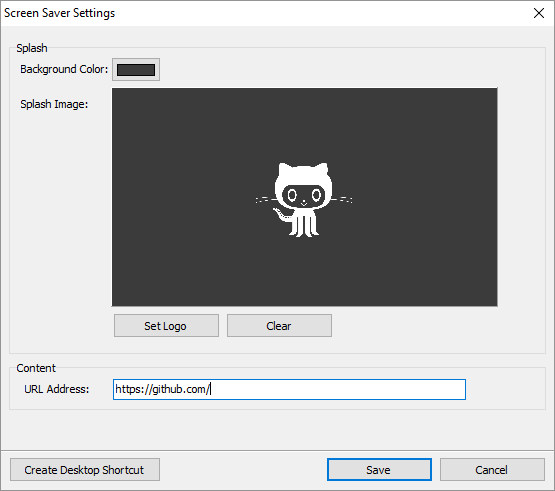
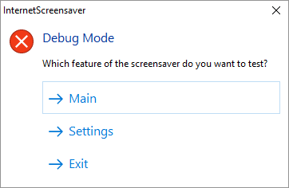

# ScreensaverKit



## About

ScreensaverKit is a screensaver toolkit written in Delphi, that supports easily building screensavers for Windows platform.

## Features

* Multi monitor support (duplicates across all monitors)
* Provides hotkey binding internally
* Provides settings supports for options persistence
* Supports building screensavers for Windows 10 platform
* True screensaver mode (hide taskbar, full screen, etc.)
* Single instance checks to disallow screensaver from running more than once
* Mouse and keyboard detection to exit the screensaver has been optimized
* Handling external changes to screensaver screen(s)

## Demo features

* Supports IE rendering engine
* Customizable URL
* Customizable splash background color and logo (default is black without logo)
* Hotkey binding to start screensaver (Achieved by accessing the screensavers settings, and clicking on create shortcut, which creates a desktop shortcut binded to the hotkey Ctrl+Alt+L)
* An indefinite progress bar that reacts to normal and erroneous url loading
* Support for JPG logos
* Made embedded IE chromeless (no scrollbars, no borders, no clickable content)

### Prerequisites

The ScreensaverKit library has no external dependencies on third party libraries or frameworks.

But the demo examples utilize modules from [JCL](https://github.com/project-jedi/jcl) and [JVCL](https://github.com/project-jedi/jvcl), therefore you must have it installed into your Delphi development environment before attempting to run them.

## API

#### Lifecycle methods

| Names | Description
| --- | ---
| `Screensaver.Initialize` | Initialize screensaver subsystem
| `Screensaver.Run` | Executes the screensaver

#### Screensaver mode interrogation methods
| Names | Description
| --- | ---
| `Screensaver.IsSettingsMode()` | Determines whether current mode is `settings`
| `Screensaver.IsSettingsModalMode()` | Determines whether current mode is modal `settings`
| `Screensaver.IsPreviewMode()` | Determines whether current mode is `preview`
| `Screensaver.IsRunMode()` | Determines whether current mode is `run`
| `Screensaver.IsPasswordMode()` | Determines whether current mode is `password`
| `Screensaver.GetScreenSaverMode()` | Returns the current state mode of the screensaver

#### Low-level related methods
| Names | Description
| --- | ---
| `Screensaver.GetParentHandle()` | Returns the window handle for the screensaver

#### Integration methods
| Names | Description
| --- | ---
| `Screensaver.CreateDesktopShortcut()` | Creates a Windows desktop keyboard shortcut

#### Settings related methods

| Names | Description
| --- | ---
| `Screensaver.Settings.GetKeyNames()` | Returns a string list containing the names of all subkeys
| `Screensaver.Settings.GetValueNames()` | Returns a string list containing the names of all data values
| `Screensaver.Settings.ReadBool()` | Retrieves a Boolean value from a specified data value
| `Screensaver.Settings.WriteBool()` | Stores a Boolean value in a specifically named data value
| `Screensaver.Settings.ReadString()` | Retrieves a string value from a specified data value
| `Screensaver.Settings.WriteString()` | Stores a string value in a specifically named data value
| `Screensaver.Settings.ReadColor()` | Retrieves a TColor value from a specified data value
| `Screensaver.Settings.WriteColor()` | Stores a TColor value in a specifically named data value
| `Screensaver.Settings.ReadInteger()` | Retrieves an integer value from a specified data value
| `Screensaver.Settings.WriteInteger()` | Stores an integer value in a specifically named data value
| `Screensaver.Settings.DeleteKey()` | Removes a specified key
| `Screensaver.Settings.SetKey()` | Sets a specified key


## Usage

The key difference between a ScreensaverKit based application, and a standard Delphi application is the usage of `Screensaver.Initialize` and `Screensaver.Run`. We do not reference or use `Application` or any of it's methods and variables.

Here is an example setup from one of the accompanied demo examples.

```delphi
program InternetScreensaver;

uses
  Main in 'Main.pas' {MainForm},
  Settings in 'Settings.pas' {SettingsForm},
  UNulContainer in 'UNulContainer.pas',
  IntfDocHostUIHandler in 'IntfDocHostUIHandler.pas',
  UContainer in 'UContainer.pas',
  ScreensaverKit in '..\..\src\ScreensaverKit.pas',
  ScreensaverKit.SettingUtils in '..\..\src\ScreensaverKit.SettingUtils.pas',
  ScreensaverKit.WebBrowserUtils in '..\..\src\ScreensaverKit.WebBrowserUtils.pas',
  ScreensaverKit.ShortcutUtils in '..\..\src\ScreensaverKit.ShortcutUtils.pas';

{$R *.res}
{$E scr}

begin
  Screensaver.Initialize;
  Screensaver.Run;
end.
```

## Debug mode

Kindly note the usage of the `{$E}` compiler directive, this sets the compiled binary file to have a `SCR` extension, which is the default extension for Windows based screensavers.

Also note that when the `{$E}` compiler directive is commented, and when run within the Delphi IDE, a special screensaver debug mode will kick in, one that eases the process of testing the screensaver without resorting to actually installing and testing it.



## Settings

The ScreensaverKit offers an embedded settings class with methods to ease the management of handling Windows registry, and to provide easy configuration support for screensaver developers.

By default, the settings class will utilize `HKEY_CURRENT_USER` as the root key of the registry, and will utilize a dynamic path built of:

```
\Software\ScreensaverKit\ + {Application name without extension}
```

For the moment, overriding the hardcoded part of the dynamic path is not allowed.

## Acknowledgments

The demo examples where made possible with the help of the great articles at [delphiDabbler.com](https://delphidabbler.com/)

## License

ScreensaverKit is licensed under the MIT License. See [LICENSE](LICENSE.md) for details.
